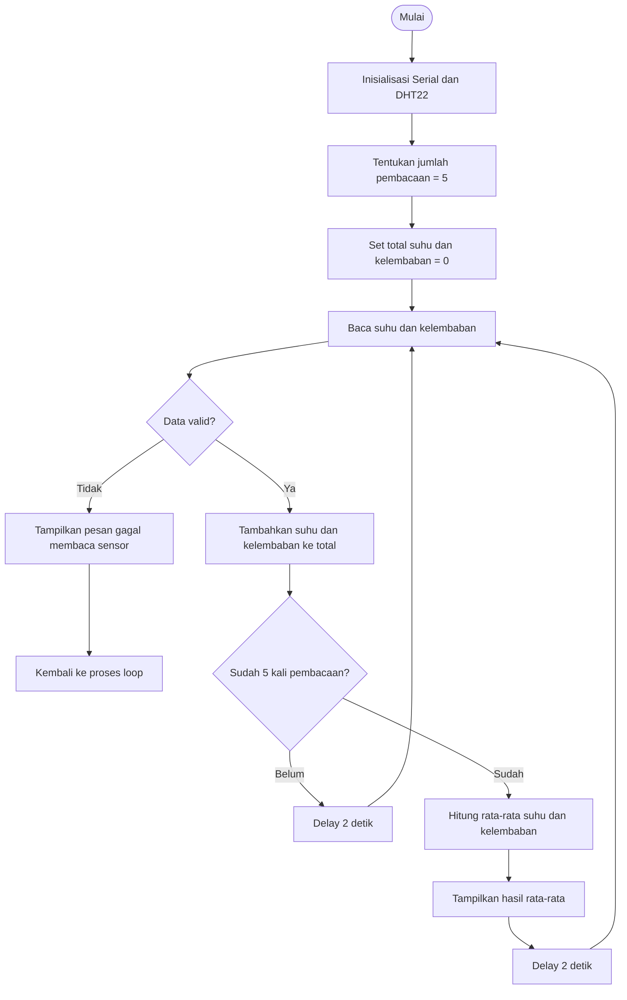

# Percobaan 1A - Akuisisi Data Sensor DHT22

## 1. Detail Percobaan

Percobaan ini bertujuan untuk melakukan akuisisi data suhu dan kelembaban menggunakan sensor DHT22 yang terhubung dengan ESP32. Data hasil pembacaan sensor diproses oleh ESP32 dan ditampilkan pada Serial Monitor.

Program dimodifikasi dari program dasar dengan menambahkan proses pembacaan sensor sebanyak **5 kali**. Hasil dari kelima pembacaan tersebut kemudian dijumlahkan dan dihitung nilai rata-ratanya sebelum ditampilkan pada Serial Monitor.

### Komponen yang Digunakan

- ESP32 DevKit
- Sensor DHT22
- Breadboard
- Kabel jumper
- Kabel USB
- Laptop/PC
- Arduino IDE

---

## 2. Library / Dependencies

Program menggunakan library:

```cpp
#include <DHT.h>
```

Library **DHT Sensor Library** digunakan untuk membaca data suhu dan kelembaban dari sensor DHT22.

Fungsi utama dari library yang digunakan:

- `dht.begin()` → menginisialisasi sensor DHT22.
- `dht.readTemperature()` → membaca nilai suhu.
- `dht.readHumidity()` → membaca nilai kelembaban.

---

## 3. Source Code

Berikut merupakan program yang telah dimodifikasi dengan pembacaan sensor sebanyak 5 kali dan perhitungan nilai rata-rata.

```cpp
#include <DHT.h>

// Menentukan GPIO ESP32 yang terhubung ke pin DATA DHT22
#define DHTPIN 4

// Menentukan jenis sensor yang digunakan
#define DHTTYPE DHT22

// Membuat objek sensor DHT22
DHT dht(DHTPIN, DHTTYPE);

void setup() {
  // Mengatur komunikasi Serial Monitor dengan baud rate 115200
  Serial.begin(115200);

  // Memulai komunikasi dengan sensor DHT22
  dht.begin();

  // Menampilkan pesan awal pada Serial Monitor
  Serial.println("Memulai akuisisi data sensor DHT22...");
}

void loop() {
  // Variabel untuk menyimpan total hasil pembacaan suhu
  float totalSuhu = 0;

  // Variabel untuk menyimpan total hasil pembacaan kelembaban
  float totalKelembaban = 0;

  // Menentukan jumlah pembacaan sensor
  int jumlahBaca = 5;

  // Melakukan pembacaan sensor sebanyak 5 kali
  for (int i = 0; i < jumlahBaca; i++) {

    // Membaca nilai kelembaban dari sensor DHT22
    float kelembaban = dht.readHumidity();

    // Membaca nilai suhu dari sensor DHT22
    float suhu = dht.readTemperature();

    // Memeriksa apakah hasil pembacaan sensor valid
    if (isnan(kelembaban) || isnan(suhu)) {

      // Menampilkan pesan jika pembacaan sensor gagal
      Serial.println("Gagal membaca data dari sensor DHT22!");

      // Menghentikan proses loop saat ini
      return;
    }

    // Menambahkan hasil pembacaan suhu ke total suhu
    totalSuhu += suhu;

    // Menambahkan hasil pembacaan kelembaban ke total kelembaban
    totalKelembaban += kelembaban;

    // Memberikan jeda 2 detik sebelum pembacaan berikutnya
    delay(2000);
  }

  // Menghitung rata-rata suhu dari 5 hasil pembacaan
  float rataSuhu = totalSuhu / jumlahBaca;

  // Menghitung rata-rata kelembaban dari 5 hasil pembacaan
  float rataKelembaban = totalKelembaban / jumlahBaca;

  // Menampilkan hasil rata-rata suhu
  Serial.print("Rata-rata Suhu: ");
  Serial.print(rataSuhu);

  // Menampilkan satuan suhu
  Serial.print(" °C, ");

  // Menampilkan hasil rata-rata kelembaban
  Serial.print("Rata-rata Kelembaban: ");
  Serial.print(rataKelembaban);

  // Menampilkan satuan kelembaban dan pindah baris
  Serial.println(" %");

  // Memberikan jeda sebelum proses pembacaan berikutnya
  delay(2000);
}
```

---

## 4. Penjelasan Fungsi `isnan()`

Pada program digunakan perintah:

```cpp
isnan(kelembaban)
isnan(suhu)
```

`isnan()` digunakan untuk memeriksa apakah hasil pembacaan sensor merupakan nilai **NaN (Not a Number)**. Nilai NaN menunjukkan bahwa data yang diperoleh dari sensor tidak valid atau gagal dibaca.

Pada program, `isnan()` digunakan pada kondisi:

```cpp
if (isnan(kelembaban) || isnan(suhu))
```

Jika nilai kelembaban atau suhu tidak valid, program akan menampilkan pesan:

```text
Gagal membaca data dari sensor DHT22!
```

Kemudian program menjalankan `return` untuk menghentikan proses `loop()` tersebut.

---

## 5. Penjelasan Percabangan / Conditional

Program menggunakan percabangan `if` untuk menentukan apakah data sensor berhasil dibaca atau tidak.

```cpp
if (isnan(kelembaban) || isnan(suhu)) {
    Serial.println("Gagal membaca data dari sensor DHT22!");
    return;
}
```

Kondisi tersebut menggunakan operator `||` atau **OR**. Artinya, apabila nilai kelembaban **atau** suhu menghasilkan NaN, maka program menganggap pembacaan sensor gagal.

Jika kondisi tersebut tidak terpenuhi, program melanjutkan proses dengan menjumlahkan data suhu dan kelembaban, kemudian melakukan pembacaan berikutnya sampai mendapatkan 5 data.

---

## 6. Modifikasi Program

Program dasar pada modul melakukan satu kali pembacaan suhu dan kelembaban sebelum menampilkannya pada Serial Monitor.

Modifikasi dilakukan dengan menambahkan proses pembacaan sebanyak **5 kali** dan menghitung nilai rata-ratanya.

### Menentukan Jumlah Pembacaan

```cpp
int jumlahBaca = 5;
```

Variabel `jumlahBaca` digunakan untuk menentukan jumlah data sensor yang akan diambil.

### Melakukan Pembacaan Berulang

```cpp
for (int i = 0; i < jumlahBaca; i++) {
```

Perulangan `for` digunakan agar proses pembacaan sensor dilakukan sebanyak 5 kali.

### Menjumlahkan Data

```cpp
totalSuhu += suhu;
totalKelembaban += kelembaban;
```

Setiap hasil pembacaan suhu dan kelembaban ditambahkan ke variabel total masing-masing.

### Menghitung Nilai Rata-rata

```cpp
float rataSuhu = totalSuhu / jumlahBaca;
float rataKelembaban = totalKelembaban / jumlahBaca;
```

Setelah lima data diperoleh, total masing-masing data dibagi dengan jumlah pembacaan untuk mendapatkan nilai rata-rata.

Dengan modifikasi tersebut, data yang ditampilkan pada Serial Monitor merupakan hasil rata-rata dari lima kali pembacaan sensor.

---

## 7. Konfigurasi Rangkaian

Sensor DHT22 dihubungkan ke ESP32 dengan konfigurasi berikut:

| No. | Komponen | Pin | ESP32 |
|-----|----------|-----|-------|
| 1 | DHT22 | VCC | 3.3V |
| 2 | DHT22 | DATA | GPIO 4 |
| 3 | DHT22 | GND | GND |

### Detail Koneksi

**1. VCC DHT22 → 3.3V ESP32**

Digunakan untuk memberikan tegangan catu daya kepada sensor DHT22.

**2. DATA DHT22 → GPIO 4 ESP32**

Pin DATA digunakan sebagai jalur komunikasi antara sensor DHT22 dan ESP32.

GPIO 4 ditentukan pada program menggunakan:

```cpp
#define DHTPIN 4
```

**3. GND DHT22 → GND ESP32**

Pin GND sensor dihubungkan dengan GND ESP32 sebagai jalur referensi tegangan rangkaian.

### Diagram Rangkaian

```text
ESP32 DevKit                         DHT22
┌───────────────┐                ┌───────────┐
│               │                │           │
│  3.3V ────────┼────────────────┤ VCC       │
│               │                │           │
│  GPIO 4 ──────┼────────────────┤ DATA      │
│               │                │           │
│  GND ─────────┼────────────────┤ GND       │
│               │                │           │
└───────────────┘                └───────────┘
```

### Keterangan

- **VCC DHT22 → 3.3V ESP32** sebagai sumber tegangan sensor.
- **DATA DHT22 → GPIO 4 ESP32** sebagai jalur pengiriman data suhu dan kelembaban.
- **GND DHT22 → GND ESP32** sebagai jalur ground rangkaian.

---

## 8. Alur Program



---

## 9. Jawaban Pertanyaan Praktikum

### 1. Apa fungsi `isnan()` pada program?

`isnan()` berfungsi untuk memeriksa apakah data suhu atau kelembaban yang dibaca sensor menghasilkan nilai NaN. Jika data tidak valid, program menampilkan pesan bahwa pembacaan sensor gagal.

### 2. Mengapa digunakan `delay(2000)`?

`delay(2000)` memberikan jeda selama 2 detik antara pembacaan sensor. Jeda digunakan agar pembacaan DHT22 tidak dilakukan terlalu cepat dan memberikan waktu bagi sensor untuk menghasilkan data berikutnya.

### 3. Mengapa dilakukan rata-rata dari 5 pembacaan?

Rata-rata digunakan untuk memperoleh nilai yang mewakili beberapa hasil pembacaan sensor, sehingga hasil yang ditampilkan tidak hanya berdasarkan satu kali pembacaan.

### 4. Bagaimana proses akuisisi data pada program?

ESP32 menginisialisasi sensor DHT22, kemudian membaca suhu dan kelembaban sebanyak 5 kali. Setiap hasil pembacaan diperiksa menggunakan `isnan()`. Jika data valid, data dijumlahkan. Setelah 5 pembacaan selesai, ESP32 menghitung nilai rata-rata suhu dan kelembaban lalu menampilkannya pada Serial Monitor.

---

## 10. Hasil Pengamatan

Hasil pengamatan disesuaikan dengan data yang diperoleh pada Serial Monitor.

Contoh tampilan:

```text
Memulai akuisisi data sensor DHT22...
Rata-rata Suhu: XX.XX °C, Rata-rata Kelembaban: XX.XX %
```

Nilai `XX.XX` diganti dengan hasil pengukuran aktual saat percobaan dilakukan.

---

## 11. Kesimpulan

Percobaan menunjukkan bahwa ESP32 dapat digunakan untuk melakukan akuisisi data suhu dan kelembaban dari sensor DHT22. Data hasil pembacaan dapat diperiksa validitasnya menggunakan `isnan()` sebelum diproses. Program yang telah dimodifikasi melakukan lima kali pembacaan sensor dan menghitung nilai rata-rata suhu serta kelembaban. Hasil rata-rata tersebut kemudian ditampilkan pada Serial Monitor sehingga proses pemantauan data sensor dapat dilakukan dengan ESP32 dan DHT22.
