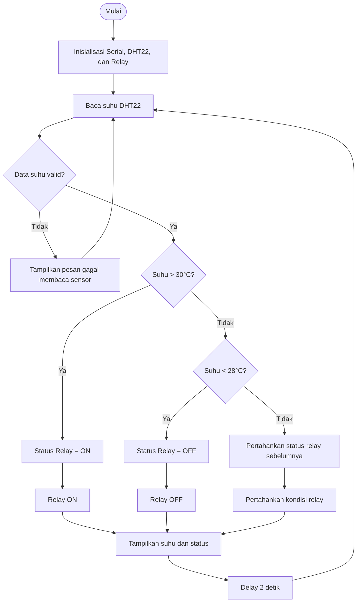

# Percobaan 2A - Kendali Aktuator Relay Berdasarkan Suhu

## 1. Detail Percobaan

Percobaan ini bertujuan untuk mengendalikan aktuator relay berdasarkan nilai suhu yang dibaca oleh sensor DHT22. ESP32 digunakan untuk membaca data suhu dari DHT22, kemudian membandingkan nilai tersebut dengan batas suhu yang telah ditentukan.

Program dimodifikasi menggunakan **hysteresis**, yaitu menggunakan dua batas suhu untuk mengendalikan relay. Relay akan **ON ketika suhu lebih dari 30°C** dan akan **OFF ketika suhu kurang dari 28°C**. Jika suhu berada di antara 28°C sampai 30°C, kondisi relay akan tetap mengikuti kondisi sebelumnya.

### Komponen yang Digunakan

- ESP32 DevKit
- Sensor DHT22
- Relay 1 channel
- LED sebagai simulasi beban/aktuator
- Resistor 220Ω
- Breadboard
- Kabel jumper
- Kabel USB
- Laptop/PC
- Arduino IDE

---

## 2. Library / Dependencies

Program menggunakan library:

```cpp
#include <DHT.h>
```

Library **DHT Sensor Library** digunakan untuk membaca data suhu dari sensor DHT22.

Fungsi utama yang digunakan:

- `dht.begin()` → menginisialisasi sensor DHT22.
- `dht.readTemperature()` → membaca nilai suhu.
- `isnan()` → memeriksa apakah hasil pembacaan sensor valid atau tidak.
- `digitalWrite()` → mengatur kondisi output relay.

---

## 3. Source Code

Berikut merupakan program yang telah dimodifikasi dengan metode hysteresis.

```cpp
#include <DHT.h>

// Menentukan GPIO ESP32 yang terhubung ke pin DATA DHT22
#define DHTPIN 4

// Menentukan jenis sensor yang digunakan
#define DHTTYPE DHT22

// Menentukan GPIO ESP32 yang digunakan untuk mengendalikan relay
#define RELAYPIN 26

// Membuat objek sensor DHT22
DHT dht(DHTPIN, DHTTYPE);

// Menentukan batas suhu untuk menyalakan relay
const float suhuOn = 30.0;

// Menentukan batas suhu untuk mematikan relay
const float suhuOff = 28.0;

// Menyimpan kondisi relay sebelumnya
bool statusRelay = false;

void setup() {
  // Mengatur komunikasi Serial Monitor dengan baud rate 115200
  Serial.begin(115200);

  // Memulai komunikasi dengan sensor DHT22
  dht.begin();

  // Mengatur GPIO relay sebagai output
  pinMode(RELAYPIN, OUTPUT);

  // Mengatur kondisi awal relay menjadi OFF
  digitalWrite(RELAYPIN, LOW);

  // Menampilkan pesan awal pada Serial Monitor
  Serial.println("Memulai kendali aktuator relay...");
}

void loop() {
  // Membaca nilai suhu dari sensor DHT22
  float suhu = dht.readTemperature();

  // Memeriksa apakah hasil pembacaan suhu valid
  if (isnan(suhu)) {

    // Menampilkan pesan jika pembacaan sensor gagal
    Serial.println("Gagal membaca data sensor!");
  } 
  else {

    // Menampilkan nilai suhu pada Serial Monitor
    Serial.print("Suhu: ");
    Serial.print(suhu);
    Serial.print(" °C -> ");

    // Jika suhu lebih dari batas ON, relay dinyalakan
    if (suhu > suhuOn) {
      statusRelay = true;
    } 

    // Jika suhu kurang dari batas OFF, relay dimatikan
    else if (suhu < suhuOff) {
      statusRelay = false;
    }

    // Memeriksa kondisi relay
    if (statusRelay) {

      // Menyalakan relay
      digitalWrite(RELAYPIN, HIGH);

      // Menampilkan status aktuator ON
      Serial.println("Aktuator: ON");
    } 
    else {

      // Mematikan relay
      digitalWrite(RELAYPIN, LOW);

      // Menampilkan status aktuator OFF
      Serial.println("Aktuator: OFF");
    }
  }

  // Memberikan jeda 2 detik sebelum pembacaan berikutnya
  delay(2000);
}
```

---

## 4. Penjelasan Fungsi `isnan()`

Pada program digunakan perintah:

```cpp
isnan(suhu)
```

`isnan()` digunakan untuk memeriksa apakah hasil pembacaan suhu dari sensor DHT22 menghasilkan nilai **NaN (Not a Number)**.

Nilai NaN menunjukkan bahwa data yang diperoleh dari sensor tidak valid atau gagal dibaca.

Perintah tersebut digunakan pada kondisi:

```cpp
if (isnan(suhu)) {
    Serial.println("Gagal membaca data sensor!");
}
```

Jika hasil pembacaan suhu tidak valid, program akan menampilkan pesan kegagalan pada Serial Monitor dan tidak menjalankan proses pengendalian relay berdasarkan data tersebut.

---

## 5. Penjelasan Percabangan / Conditional

Program menggunakan beberapa percabangan untuk menentukan kondisi relay berdasarkan suhu.

### Percabangan Pemeriksaan Sensor

```cpp
if (isnan(suhu)) {
    Serial.println("Gagal membaca data sensor!");
}
else {
    // Proses kendali relay
}
```

Percabangan ini digunakan untuk memastikan data suhu valid sebelum digunakan dalam proses pengendalian relay.

### Percabangan Hysteresis

```cpp
if (suhu > suhuOn) {
    statusRelay = true;
}
else if (suhu < suhuOff) {
    statusRelay = false;
}
```

Percabangan tersebut menggunakan dua batas suhu:

- Jika **suhu > 30°C**, `statusRelay` menjadi `true` sehingga relay ON.
- Jika **suhu < 28°C**, `statusRelay` menjadi `false` sehingga relay OFF.
- Jika suhu berada pada **28°C–30°C**, tidak ada kondisi yang terpenuhi sehingga `statusRelay` tetap pada kondisi sebelumnya.

### Percabangan Kondisi Relay

```cpp
if (statusRelay) {
    digitalWrite(RELAYPIN, HIGH);
    Serial.println("Aktuator: ON");
}
else {
    digitalWrite(RELAYPIN, LOW);
    Serial.println("Aktuator: OFF");
}
```

Percabangan ini digunakan untuk menentukan sinyal yang diberikan ke relay berdasarkan nilai `statusRelay`.

---

## 6. Modifikasi Program

Program dasar pada modul menggunakan satu batas suhu, yaitu:

```cpp
const float suhuThreshold = 30.0;
```

Relay akan ON jika suhu lebih dari 30°C dan OFF jika suhu tidak melebihi 30°C.

Pada program yang dimodifikasi, digunakan dua batas suhu untuk menerapkan **hysteresis**:

```cpp
const float suhuOn = 30.0;
const float suhuOff = 28.0;
```

### Batas Suhu ON

```cpp
if (suhu > suhuOn) {
    statusRelay = true;
}
```

Jika suhu lebih dari 30°C, nilai `statusRelay` diubah menjadi `true`, sehingga relay akan menyala.

### Batas Suhu OFF

```cpp
else if (suhu < suhuOff) {
    statusRelay = false;
}
```

Jika suhu kurang dari 28°C, nilai `statusRelay` diubah menjadi `false`, sehingga relay akan mati.

### Menyimpan Kondisi Relay

```cpp
bool statusRelay = false;
```

Variabel `statusRelay` digunakan untuk menyimpan kondisi relay sebelumnya.

Jika suhu berada di antara 28°C dan 30°C, tidak ada perubahan pada `statusRelay`. Dengan demikian, relay mempertahankan kondisi sebelumnya.

### Tujuan Hysteresis

Penggunaan dua batas suhu bertujuan untuk mengurangi perubahan kondisi relay yang terlalu sering ketika suhu berada di sekitar batas 30°C.

Contohnya:

| Kondisi Suhu | Kondisi Relay |
|--------------|---------------|
| Suhu > 30°C | ON |
| 28°C ≤ Suhu ≤ 30°C | Tetap pada kondisi sebelumnya |
| Suhu < 28°C | OFF |

---

## 7. Konfigurasi Rangkaian

Sensor DHT22 dan relay dihubungkan ke ESP32 dengan konfigurasi berikut.

### DHT22

| No. | Komponen | Pin | ESP32 |
|-----|----------|-----|-------|
| 1 | DHT22 | VCC | 3.3V |
| 2 | DHT22 | DATA | GPIO 4 |
| 3 | DHT22 | GND | GND |

### Relay

| No. | Komponen | Pin | ESP32 |
|-----|----------|-----|-------|
| 1 | Relay | IN | GPIO 26 |
| 2 | Relay | VCC | VIN / 5V |
| 3 | Relay | GND | GND |

### LED sebagai Simulasi Aktuator

LED digunakan sebagai simulasi beban/aktuator yang dikendalikan oleh relay.

Jika menggunakan LED:

- Anoda LED → kontak relay sesuai rangkaian
- Katoda LED → GND
- Resistor 220Ω digunakan sebagai pembatas arus LED

### Diagram Rangkaian

```text
                 ESP32 DevKit
          ┌──────────────────────┐
          │                      │
          │  3.3V ───────────────┼──────── VCC
          │                      │          DHT22
          │  GPIO 4 ─────────────┼──────── DATA
          │                      │
          │  GND ────────────────┼──────── GND
          │                      │
          │                      │
          │  GPIO 26 ────────────┼──────── IN
          │                      │          Relay
          │  VIN / 5V ──────────┼──────── VCC
          │                      │
          │  GND ────────────────┼──────── GND
          │                      │
          └──────────────────────┘
```

### Keterangan

- **DHT22 VCC → 3.3V ESP32** sebagai sumber tegangan sensor.
- **DHT22 DATA → GPIO 4 ESP32** sebagai jalur data sensor.
- **DHT22 GND → GND ESP32** sebagai ground sensor.
- **Relay IN → GPIO 26 ESP32** sebagai sinyal kendali relay.
- **Relay VCC → VIN/5V ESP32** sebagai sumber tegangan relay.
- **Relay GND → GND ESP32** sebagai ground relay.

GPIO yang digunakan pada program:

```cpp
#define DHTPIN 4
#define RELAYPIN 26
```

---

## 8. Alur Program



---

## 9. Jawaban Pertanyaan Praktikum

### 1. Apa tujuan penggunaan threshold pada kendali relay?

Threshold digunakan sebagai batas untuk menentukan kapan relay harus menyala atau mati berdasarkan nilai suhu yang dibaca oleh sensor DHT22.

### 2. Apa yang terjadi jika threshold diubah menjadi 20°C?

Jika menggunakan batas 20°C, relay akan menyala ketika suhu melebihi 20°C dan akan mati ketika suhu berada pada atau di bawah batas tersebut. Dengan batas yang lebih rendah, relay akan lebih mudah berada pada kondisi ON dibandingkan menggunakan batas 30°C.

### 3. Apa perbedaan single condition dengan hysteresis?

Single condition menggunakan satu batas suhu untuk menentukan perubahan kondisi relay. Kondisi relay dapat berubah ketika suhu melewati batas tersebut.

Hysteresis menggunakan dua batas, yaitu batas ON dan batas OFF. Pada program ini relay ON ketika suhu lebih dari 30°C dan OFF ketika suhu kurang dari 28°C. Jika suhu berada di antara kedua batas tersebut, kondisi relay tetap seperti sebelumnya.

### 4. Mengapa hysteresis dapat mengurangi perubahan relay yang terlalu sering?

Hysteresis memberikan rentang suhu antara batas ON dan OFF. Ketika suhu berada pada rentang tersebut, kondisi relay tidak langsung berubah sehingga relay tidak mudah mengalami perubahan ON dan OFF akibat perubahan suhu yang kecil di sekitar batas.

### 5. Bagaimana hubungan sensor dengan aktuator pada program?

DHT22 berfungsi sebagai sensor yang membaca suhu lingkungan. Data suhu kemudian diproses oleh ESP32 dan dibandingkan dengan batas suhu. Berdasarkan hasil perbandingan tersebut, ESP32 mengendalikan relay sebagai aktuator.

---

## 10. Hasil Pengamatan

Hasil pengamatan disesuaikan dengan kondisi yang diperoleh saat menjalankan program.

Contoh tampilan Serial Monitor:

```text
Memulai kendali aktuator relay...
Suhu: 29.50 °C -> Aktuator: OFF
Suhu: 30.20 °C -> Aktuator: ON
Suhu: 29.80 °C -> Aktuator: ON
Suhu: 27.80 °C -> Aktuator: OFF
```

Berdasarkan contoh tersebut:

- Pada suhu **29,50°C**, relay masih OFF.
- Ketika suhu **30,20°C**, relay berubah menjadi ON.
- Saat suhu turun menjadi **29,80°C**, relay tetap ON karena masih berada pada rentang hysteresis.
- Ketika suhu turun menjadi **27,80°C**, relay berubah menjadi OFF.

Hasil aktual disesuaikan dengan pengamatan saat percobaan dilakukan.

---

## 11. Kesimpulan

Percobaan menunjukkan bahwa ESP32 dapat digunakan untuk mengendalikan aktuator relay berdasarkan data suhu yang diperoleh dari sensor DHT22. Data suhu dibaca dan diproses oleh ESP32, kemudian digunakan sebagai dasar untuk menentukan kondisi relay.

Modifikasi menggunakan metode hysteresis dengan batas ON sebesar 30°C dan batas OFF sebesar 28°C membuat relay tidak langsung berubah kondisi ketika suhu berada di antara kedua batas tersebut. Dengan demikian, perubahan kondisi relay akibat fluktuasi suhu kecil di sekitar batas dapat dikurangi.
