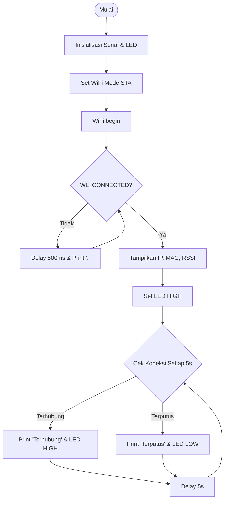

## 1. Detail & Ringkasan Percobaan

* **Percobaan 1 (Mode Station - STA):** ESP8266 dikonfigurasi sebagai *client* yang terhubung ke jaringan eksternal (SSID: `naye`). Program membaca parameter IP, MAC Address, RSSI, mengendalikan LED indikator (GPIO 4), serta mengeksekusi logika *Auto-Reconnect* saat koneksi terputus.

## 2. Dependencies & Library

| Library / Software | Versi / Parameter | Fungsi |
| :--- | :--- | :--- |
| `ESP8266WiFi.h` | Native ESP8266 Core | Mengelola antarmuka jaringan nirkabel (STA, AP, AP+STA) |
| Arduino IDE | v2.3.x / v1.8.x | IDE Pemrograman & Serial Monitor (Baudrate: 115200) |

---

## 3. Skematik Rangkaian & Flowchart

### A. Tabel Wiring Pin

| Komponen | Pin ESP8266 | Keterangan |
| :--- | :--- | :--- |
| **LED Indikator Anoda (+)** | GPIO 4 (D2) | Terhubung seri dengan Resistor 220 Ohm |
| **LED Indikator Katoda (-)** | GND | Ground modul |
| **Micro USB** | Port USB | Catu daya dan komunikasi Serial (COM) |

### B. Flowchart Mode Station (STA)



---

## 4. Percobaan 1: Mode Station (STA) + Auto-Reconnect

### A. Code Final

```cpp
#include <ESP8266WiFi.h>

const char* ssid     = "naye";
const char* password = "woylahbroo";
const int ledPin     = 4;

void setup() {
  Serial.begin(115200);
  pinMode(ledPin, OUTPUT);
  digitalWrite(ledPin, LOW);

  WiFi.mode(WIFI_STA);
  WiFi.begin(ssid, password);

  Serial.print("Menghubungkan ke WiFi:");
  while (WiFi.status() != WL_CONNECTED) {
    delay(500);
    Serial.print(".");
  }

  Serial.println("\nWiFi berhasil terhubung!");
  Serial.print("IP Address  : "); Serial.println(WiFi.localIP());
  Serial.print("MAC Address : "); Serial.println(WiFi.macAddress());
  Serial.print("RSSI (dBm)  : "); Serial.println(WiFi.RSSI());

  digitalWrite(ledPin, HIGH);
}

void loop() {
  if (WiFi.status() != WL_CONNECTED) {
    digitalWrite(ledPin, LOW);
    Serial.println("Koneksi terputus! Mencoba menghubungkan kembali...");

    WiFi.disconnect();
    WiFi.reconnect();
  } else {
    Serial.println("Status: Terhubung");
    digitalWrite(ledPin, HIGH);
  }

  delay(5000);
}
```

### B. Penjelasan Code, Fungsi, dan Percabangan

* `WiFi.mode(WIFI_STA)`: Mengatur mode kerja perangkat menjadi *client* (Station).
* `WiFi.begin(ssid, password)`: Menginisialisasi proses koneksi ke router/hotspot target.
* `while (WiFi.status() != WL_CONNECTED)`: Loop penantian hingga status jaringan terhubung.
* Conditional `if (WiFi.status() != WL_CONNECTED)`: Pengecekan berkala pada `loop()`. Jika koneksi terputus, LED dipadamkan, sisa sesi lama dibersihkan via `WiFi.disconnect()`, dan dipanggil `WiFi.reconnect()` untuk koneksi ulang otomatis.

### C. Tabel Hasil Pengujian Mode STA

| No | Kondisi Pengujian | SSID | Password | Status Koneksi | Output Serial Monitor | Keterangan |
| :--- | :--- | :--- | :--- | :--- | :--- | :--- |
| 1 | Kredensial Benar | naye | woylahbroo | Terkoneksi | `WiFi berhasil terhubung!` | Perangkat terhubung, IP didapatkan, LED menyala |
| 2 | Kredensial Salah | naye | 123admin | Tidak Terkoneksi | `Menghubungkan ke WiFi:.....` | Gagal autentikasi, tertahan di loop penantian, LED mati |
| 3 | SSID Salah | namyu | woylahbroo | Tidak Terkoneksi | `Menghubungkan ke WiFi:.....` | SSID tidak ditemukan, tertahan di loop penantian, LED mati |

### D. Jawaban Pertanyaan 2.5.4

1. **Flowchart:** Telah disertakan pada Bagian 3B.
2. **Fungsi `WiFi.mode(WIFI_STA)`:** Mengatur ESP8266 agar beroperasi sebagai *client* nirkabel yang terhubung ke Access Point eksternal.
3. **SSID/Password Salah:** Perangkat tertahan di perulangan `while (WiFi.status() != WL_CONNECTED)`, Serial Monitor hanya mencetak deretan titik (`.....`), IP tidak didapatkan, dan LED indikator tetap padam.
4. **Modifikasi Reconnect:** Telah diimplementasikan pada Code Final & Bagian 4B.
