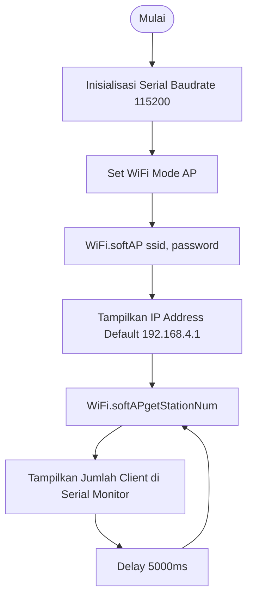

# Percobaan 2 — Konfigurasi Jaringan WiFi Mode Access Point (AP)

## 1. Detail & Ringkasan Percobaan

**Percobaan 2 (Mode Access Point - AP):** ESP8266 dikonfigurasi sebagai pemancar *hotspot* mandiri (SSID: `ESP8266_AccessPoint`, IP: `192.168.4.1`) tanpa memerlukan router eksternal. Program memantau dan menampilkan jumlah perangkat (*client*) yang terhubung secara *real-time* melalui Serial Monitor.

---

## 2. Dependencies & Library

| Library / Software | Versi / Parameter | Fungsi |
| :--- | :--- | :--- |
| `ESP8266WiFi.h` | Native ESP8266 Core | Mengelola antarmuka jaringan nirkabel (STA, AP, AP+STA) |
| Arduino IDE | v2.3.x / v1.8.x | IDE Pemrograman & Serial Monitor (Baudrate: 115200) |

---

## 3. Skematik Rangkaian & Flowchart

### A. Tabel Wiring Pin

| Komponen | Pin ESP8266 | Keterangan |
| :--- | :--- | :--- |
| **Micro USB** | Port USB | Catu daya dan komunikasi Serial (COM) |

### B. Flowchart Mode Access Point (AP)



---

## 4. Percobaan 2: Mode Access Point (AP)

### A. Code Final

```cpp
#include <ESP8266WiFi.h>

const char* ap_ssid     = "ESP8266_AccessPoint";
const char* ap_password = "12345678";

void setup() {
  Serial.begin(115200);

  WiFi.mode(WIFI_AP);
  WiFi.softAP(ap_ssid, ap_password);

  IPAddress apIP = WiFi.softAPIP();
  Serial.println("Access Point aktif!");
  Serial.print("SSID        : "); Serial.println(ap_ssid);
  Serial.print("IP Address  : "); Serial.println(apIP);
}

void loop() {
  int jumlahClient = WiFi.softAPgetStationNum();
  Serial.print("Jumlah perangkat terhubung: ");
  Serial.println(jumlahClient);
  delay(5000);
}
```

### B. Penjelasan Code, Fungsi, dan Percabangan

| Fungsi | Penjelasan |
| :--- | :--- |
| `WiFi.mode(WIFI_AP)` | Mengubah mode operasional radio ESP8266 menjadi Access Point (pemancar hotspot). |
| `WiFi.softAP(ap_ssid, ap_password)` | Mengaktifkan jaringan nirkabel lokal menggunakan SSID dan password yang telah ditentukan (minimal 8 karakter). |
| `WiFi.softAPIP()` | Memanggil alamat IP default gateway dari Access Point ESP8266 (`192.168.4.1`). |
| `WiFi.softAPgetStationNum()` | Fungsi untuk mengambil data jumlah perangkat (client) yang sedang terhubung ke Access Point. |

### C. Tabel Hasil Pengamatan Mode AP

**Tabel 1. Pengamatan Konfigurasi AP**

| No | Parameter | Nilai Konfigurasi | Hasil Pengamatan |
| :-: | :--- | :--- | :--- |
| 1 | SSID | ESP8266_AccessPoint | Terdeteksi di pencarian WiFi perangkat |
| 2 | Password | 12345678 | Berhasil digunakan |
| 3 | IP Address AP | 192.168.4.1 | 192.168.4.1 |
| 4 | Status Access Point | Aktif | Aktif |
| 5 | SSID terdeteksi pada client | Ya | Ya |
| 6 | Perangkat berhasil terhubung | - | Ya, 3 perangkat terhubung |

**Tabel 2. Pengamatan Jumlah Perangkat Terhubung**

| No | Waktu (s) | Jumlah Client | Perangkat Terhubung | Keterangan |
| :-: | :-: | :-: | :--- | :--- |
| 1 | 0 | 0 | - | Belum ada perangkat terhubung |
| 2 | 5 | 0 | - | Standby menunggu koneksi |
| 3 | 10 | 0 | - | Standby menunggu koneksi |
| 4 | 15 | 0 | - | Standby menunggu koneksi |
| 5 | 20 | 0 | - | Standby menunggu koneksi |
| 6 | 25 | 1 | Hp 1 | Perangkat terkoneksi 1 |
| 7 | 30 | 1 | Hp 1 | Perangkat terkoneksi 1 |
| 8 | 35 | 2 | Hp 2 | Perangkat terkoneksi 2 |
| 9 | 40 | 2 | Hp 2 | Perangkat terkoneksi 2 |
| 10 | 45 | 3 | Hp 2 & Laptop 1 | Perangkat terkoneksi 3 |

### D. Kendala Percobaan 2

- Kegagalan otentikasi client akibat penggunaan kata sandi di bawah 8 karakter, yang diselesaikan dengan mengonsolidasi password sesuai standar WPA2-PSK.
- Terdapat jeda pembaruan data client hingga 5 detik pada Serial Monitor akibat penggunaan instruksi `delay(5000)` pada program.
- Jangkauan sinyal Hotspot ESP8266 juga terbatas karena hanya mengandalkan antena PCB internal.

### E. Jawaban Pertanyaan 2.6.4

**1. Mengapa Alamat IP AP Default `192.168.4.1`?**

Karena merupakan standar IP gateway bawaan yang sudah diatur dalam firmware untuk antarmuka softAP. Pemilihan subnet `192.168.4.x` bertujuan untuk mencegah terjadinya bentrok alamat IP dengan jaringan router pada umumnya.

**2. Perbedaan Dasar Mode Station dan Access Point**

- **Mode Station (STA):** Perangkat bertindak sebagai client (seperti smartphone/laptop) yang membutuhkan router/hotspot eksternal untuk terhubung ke jaringan lokal atau internet.
- **Mode Access Point (AP):** Perangkat bertindak sebagai host penyedia jaringan (hotspot) mandiri yang memancarkan SSID sendiri agar perangkat dapat terhubung tanpa butuh router eksternal.

**3. Risiko Keamanan Password AP Kosong/Sederhana**

Terjadi risiko akses tanpa izin oleh perangkat asing, penyadapan lalu lintas data (Man-in-the-Middle), serta ancaman serangan DoS yang dapat menyebabkan sistem freeze atau crash.

**4. Modifikasi Program AP+STA**

```cpp
#include <ESP8266WiFi.h>

const char* sta_ssid     = "naye";
const char* sta_password = "woylahbroo";
const char* ap_ssid      = "ESP_Hotspot";
const char* ap_password  = "12345678";

void setup() {
  Serial.begin(115200);

  // Mengaktifkan kombinasi mode Station dan Access Point secara bersamaan
  WiFi.mode(WIFI_AP_STA);

  // Menghubungkan perangkat ke WiFi rumah (STA)
  WiFi.begin(sta_ssid, sta_password);

  // Memancarkan jaringan Access Point mandiri (AP)
  WiFi.softAP(ap_ssid, ap_password);

  Serial.println("Mode AP+STA Aktif!");

  // Menampilkan IP address dari masing-masing mode
  Serial.print("IP Mode Station (STA): ");
  Serial.println(WiFi.localIP());
  Serial.print("IP Mode Access Point (AP): ");
  Serial.println(WiFi.softAPIP());
}

void loop() {
  // Menampilkan jumlah client yang terhubung ke AP perangkat
  int jumlahClient = WiFi.softAPgetStationNum();
  Serial.print("Jumlah client terhubung ke AP: ");
  Serial.println(jumlahClient);
  delay(5000);
}
```
