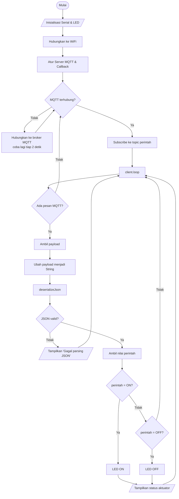

## 1. Detail Percobaan

Percobaan pertama (4A) bertujuan untuk memahami cara kerja mekanisme **subscribe** pada protokol **MQTT** dan proses **deserialisasi data JSON** yang diterima oleh ESP8266 untuk digunakan sebagai perintah kendali aktuator (LED). ESP8266 terhubung ke WiFi dan broker MQTT `broker.hivemq.com`, kemudian melakukan subscribe pada topic `unsoed/tk245004/kelompok2/perintah`. Setiap pesan JSON berisi `{"perintah":"ON"}` atau `{"perintah":"OFF"}` yang diterima akan di-parsing, lalu LED dinyalakan atau dimatikan sesuai isi perintah.

### Rangkaian

| No | Komponen | Pin ESP8266 |
|---|---|---|
| 1 | LED anoda | D5 |
| 2 | LED katoda | Resistor ke GND |
| 3 | WiFi | Internet |
| 4 | MQTT Broker | broker.hivemq.com |

## 2. Library / Dependencies yang Diperlukan

| Library | Fungsi |
|---|---|
| `ESP8266WiFi.h` | Menghubungkan ESP8266 ke jaringan WiFi |
| `PubSubClient.h` | Komunikasi menggunakan protokol MQTT (publish/subscribe) |
| `ArduinoJson.h` | Parsing/deserialisasi data JSON |

`ESP8266WiFi.h` sudah termasuk dalam board package ESP8266, sedangkan `PubSubClient` dan `ArduinoJson` dipasang melalui **Library Manager** pada Arduino IDE.

## 3. Penjelasan Code

### 3.1 Deklarasi & Konfigurasi

```cpp
const char* ssid          = "rakjel";
const char* password      = "entersaja";
const char* mqttServer    = "broker.hivemq.com";
const int   mqttPort      = 1883;
const char* topicPerintah = "unsoed/tk245004/kelompok2/perintah";
const int   ledPin        = D5;   // pin LED (sesuai rangkaian)
```

Bagian ini mendefinisikan kredensial WiFi, alamat dan port broker MQTT, topic yang di-subscribe untuk menerima perintah, serta pin LED. Objek `WiFiClient espClient` dan `PubSubClient client(espClient)` dibuat sebagai dasar koneksi jaringan dan MQTT.

### 3.2 Fungsi `callback()`

Dipanggil otomatis setiap ada pesan MQTT masuk pada topic yang di-subscribe. Alurnya:

1. Mengubah `payload` (array byte) menjadi `String pesan` dengan perulangan `for`.
2. Menampilkan topic dan isi pesan ke Serial Monitor.
3. Membuat `JsonDocument doc` dan memanggil `deserializeJson(doc, pesan)` untuk mengubah teks JSON menjadi data yang bisa dibaca program.
4. Jika parsing gagal, tampilkan `Gagal parsing JSON: ...` lalu `return`.
5. Mengambil nilai `doc["perintah"]`.
6. Jika `ON` → `digitalWrite(ledPin, HIGH)`; jika `OFF` → `digitalWrite(ledPin, LOW)`, disertai pesan status di Serial Monitor.

### 3.3 Fungsi `hubungkanWiFi()`

Memanggil `WiFi.begin(ssid, password)` lalu menunggu dengan `while` sampai status `WL_CONNECTED`. Setiap 500 ms dicetak tanda titik sebagai indikator proses, lalu dicetak pesan `WiFi berhasil terhubung!`.

### 3.4 Fungsi `hubungkanMQTT()`

Selama client belum terhubung ke broker, fungsi ini:

1. Membuat `clientId` acak (`"ESP8266Client-" + String(random(0xffff), HEX)`).
2. Mencoba `client.connect(clientId.c_str())`.
3. Jika berhasil, langsung `client.subscribe(topicPerintah)` dan menampilkan topic yang di-subscribe.
4. Jika gagal, menampilkan kode `rc` (`client.state()`) dan mencoba lagi setelah 2 detik.

### 3.5 Fungsi `setup()`

Dijalankan sekali saat ESP8266 menyala/reset:

1. `Serial.begin(115200)`.
2. `pinMode(ledPin, OUTPUT)` dan `digitalWrite(ledPin, LOW)` (LED awal mati).
3. `hubungkanWiFi()`.
4. `client.setServer(mqttServer, mqttPort)`.
5. `client.setCallback(callback)` untuk mendaftarkan fungsi penerima pesan.

### 3.6 Fungsi `loop()`

Jika koneksi MQTT terputus, panggil `hubungkanMQTT()`. Kemudian `client.loop()` dijalankan terus-menerus untuk memproses pesan masuk dan menjaga koneksi dengan broker.

## 4. Penjelasan Percabangan / Conditional

| Percabangan | Lokasi | Penjelasan |
|---|---|---|
| `while (WiFi.status() != WL_CONNECTED)` | `hubungkanWiFi()` | Menahan program sampai ESP8266 benar-benar terhubung ke WiFi. |
| `while (!client.connected())` | `hubungkanMQTT()` | Mengulang percobaan koneksi ke broker sampai berhasil. |
| `if (client.connect(...)) { ... } else { ... }` | `hubungkanMQTT()` | Jika berhasil, lakukan subscribe; jika gagal, tampilkan `rc` dan tunggu 2 detik sebelum mencoba lagi. |
| `if (error)` | `callback()` | Jika JSON tidak valid, tampilkan pesan error dan keluar dari callback tanpa mengubah LED. |
| `if (String(perintah) == "ON") ... else if (String(perintah) == "OFF")` | `callback()` | Menentukan aksi aktuator: `ON` menyalakan LED, `OFF` mematikan LED. |
| `if (!client.connected())` | `loop()` | Menyambungkan kembali ke broker MQTT jika koneksi terputus. |

## 5. Hasil Pengamatan (Ringkasan)

Pengujian dilakukan sebanyak 5 kali pengiriman perintah dari MQTT client.

| No | Perintah JSON | Pesan Diterima | Hasil Parsing | Status LED | Keterangan |
|---|---|---|---|---|---|
| 1 | `{"perintah":"ON"}` | ON | ON | Menyala | LED menyala setelah menerima perintah ON |
| 2 | `{"perintah":"OFF"}` | OFF | OFF | Mati | LED mati setelah menerima perintah OFF |
| 3 | `{"perintah":"ON"}` | ON | ON | Menyala | LED kembali menyala setelah menerima perintah ON |
| 4 | `{"perintah":"OFF"}` | OFF | OFF | Mati | LED kembali mati setelah menerima perintah OFF |
| 5 | `{"perintah":"ON"}` | ON | ON | Menyala | LED menyala setelah menerima perintah ON |

## 6. Modifikasi Program

Sesuai jawaban pertanyaan praktikum poin 4, ditambahkan field `intensitas` pada JSON untuk mengatur kecerahan LED menggunakan PWM (`analogWrite`):

```cpp
// Mengambil nilai perintah dan intensitas dari JSON
const char* perintah = doc["perintah"];
int intensitas = doc["intensitas"];

// Mengecek perintah yang diterima
if (String(perintah) == "ON") {
  // Mengatur kecerahan LED sesuai nilai intensitas
  analogWrite(ledPin, intensitas);

  Serial.print("Aktuator: ON, Intensitas: ");
  Serial.println(intensitas);

} else if (String(perintah) == "OFF") {
  // Mematikan LED
  analogWrite(ledPin, 0);
  Serial.println("Aktuator: OFF");
}
```

Contoh payload: `{"perintah":"ON","intensitas":128}`. Pada ESP8266, `analogWrite` menerima nilai 0–1023 secara default.

## 7. Jawaban Pertanyaan Praktikum (Terkait Code)

1. **Flowchart proses subscribe & deserialisasi JSON:**


2. Jika pesan bukan JSON yang valid, `deserializeJson()` menghasilkan error. Program menampilkan pesan **"Gagal parsing JSON"** di Serial Monitor dan tidak melanjutkan proses pengendalian LED dari data tersebut.
3. `client.subscribe()` harus dilakukan setelah ESP8266 berhasil terhubung ke broker MQTT. Fungsi `hubungkanMQTT()` menangani koneksi dan langsung melakukan subscribe saat koneksi berhasil. Dengan begitu, subscribe juga otomatis diulang ketika koneksi sempat terputus lalu tersambung kembali.
4. **Modifikasi program:** penambahan field `intensitas` untuk mengatur kecerahan LED (lihat bagian 6).

## 8. Kendala

Koneksi ESP8266 ke WiFi dan broker MQTT berhasil dilakukan, tetapi pada Serial Monitor belum terlihat pesan JSON yang masuk dari MQTT client. Akibatnya, proses deserialisasi dan perubahan kondisi LED berdasarkan perintah ON/OFF belum dapat diamati dengan jelas pada hasil Serial Monitor.
